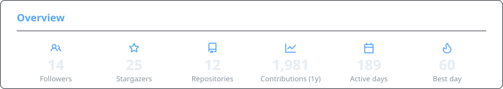
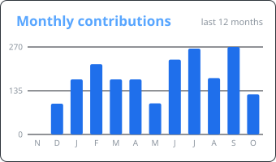

<picture>
  <source media="(prefers-color-scheme: dark)" srcset="https://readme-typing-svg.demolab.com?font=Fira+Code&weight=500&size=26&duration=2800&pause=900&color=1F6FEB&center=true&vCenter=true&width=560&height=46&lines=Ahmet+Palavan;Software+Engineer;Web+%26+Mobile+%C2%B7+TypeScript">
  <source media="(prefers-color-scheme: light)" srcset="https://readme-typing-svg.demolab.com?font=Fira+Code&weight=500&size=26&duration=2800&pause=900&color=0969DA&center=true&vCenter=true&width=560&height=46&lines=Ahmet+Palavan;Software+Engineer;Web+%26+Mobile+%C2%B7+TypeScript">
  
</picture>

---

## About

Software Engineer based in Turkey, building web and mobile products with TypeScript. Most of my work is Next.js and React on the web and React Native with Expo on mobile, backed by Node.js and NestJS services over PostgreSQL, MongoDB, Firebase and Supabase.

Lately I have been focused on AI-powered products: video generation tools, chatbots and SaaS apps. I like owning a product end to end, from the UI and API to the database and the deploy, with Tailwind, shadcn/ui, TanStack Query and Zustand on the front end and Prisma on the back end.

---

## Statistics

<picture>
  <source media="(prefers-color-scheme: dark)" srcset="./assets/overview-dark.svg">
  <source media="(prefers-color-scheme: light)" srcset="./assets/overview-light.svg">
  
</picture>

<picture>
  <source media="(prefers-color-scheme: dark)" srcset="https://streak-stats.demolab.com?user=ahmetpalavan&theme=github-dark-blue&hide_border=true&border_radius=10&date_format=j%20M%5B%20Y%5D&card_width=460">
  <source media="(prefers-color-scheme: light)" srcset="https://streak-stats.demolab.com?user=ahmetpalavan&hide_border=true&border_radius=10&date_format=j%20M%5B%20Y%5D&card_width=460&background=FFFFFF&ring=0969DA&fire=0969DA&currStreakNum=1F2328&sideNums=1F2328&currStreakLabel=0969DA&sideLabels=1F2328&dates=656D76&stroke=D0D7DE">
  
</picture>

<picture>
  <source media="(prefers-color-scheme: dark)" srcset="./assets/activity-dark.svg">
  <source media="(prefers-color-scheme: light)" srcset="./assets/activity-light.svg">
  
</picture>

  

